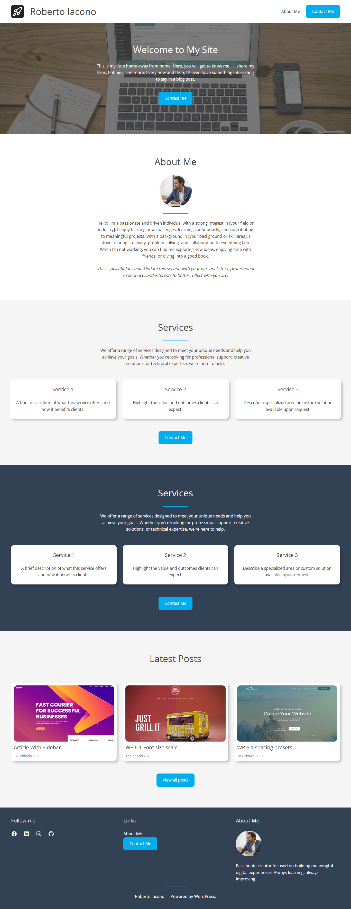

# RIACO Theme

A simple, minimal block-based WordPress theme built for personal use.

## Screenshot

== Description ==

A simple, minimal block-based WordPress theme built for personal use and full site editing. Designed for clarity and ease of customization, it features a subtle, modern color palette with a bright primary accent (#00aeef) and neutral base tones for content-focused layouts.

Ideal for personal blogs or lightweight websites, this theme is fully compatible with the block editor and WordPress Full Site Editing (FSE). To add a button in the header, simply place a button block after the navigation links—no extra configuration required.

Palette highlights:

Primary: Bright Blue (#00aeef)

Secondary: Deep Blue (#045cb4)

Base Tones: Soft White to Charcoal

Contrast: Clean, readable dark gray

No legacy PHP templates—pure blocks for a modern, personal blogging experience.

== Fonts ==

Open Sans
Copyright 2020 The Open Sans Project Authors (https://github.com/googlefonts/opensans)
Source: http://www.google.com/get/noto/
License: This Font Software is licensed under the SIL Open Font License, Version 1.1. This license is available with a FAQ at: https://scripts.sil.org/OFL
